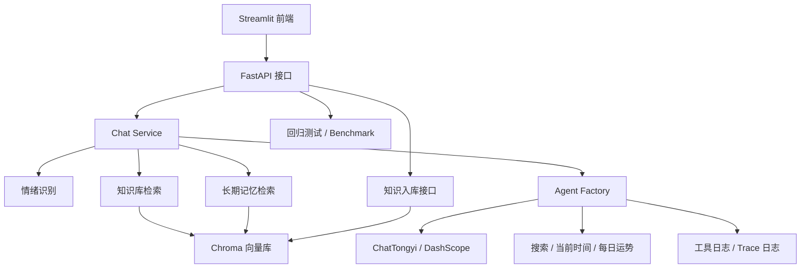
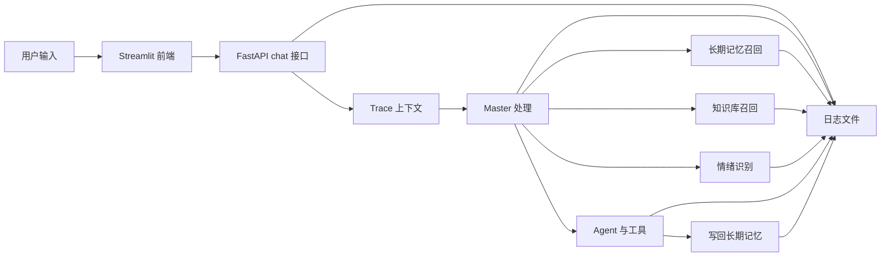

# StarOracle_Agent 星座运势助手

**基于 LangChain / LangGraph / Streamlit 构建的星座运势问答助手，支持 ReAct Agent 推理、多工具调用、RAG 检索、分层长期记忆、可观测调试、离线评测与回归测试，以及 URL / PDF / 文本知识入库。**

[](https://www.python.org/) &nbsp;    

---

## 📖 项目简介

本项目以“星座运势问答”为主场景，后端使用 FastAPI 提供接口服务，Agent 侧通过 LangChain ReAct 模式完成推理与工具选择，前端使用 Streamlit 提供聊天式交互界面。

经过最近一轮工程化升级后，这个 demo 已经从“能聊天”扩展成了“能稳定运行、能评估、能解释、能持续迭代”的 Agent 原型，比较适合作为简历项目或面试讲解项目。

系统包含以下能力：

- 结合用户输入进行情绪识别与角色风格切换
- 通过 Chroma 向量库实现知识库检索与长期记忆
- 支持 URL、PDF、文本三种方式写入知识库
- 支持每日运势占卜、当前时间、联网搜索等工具
- 支持请求级 trace id、日志注入与调试开关
- 支持长期记忆分层、过期清理与最近上下文保留
- 支持离线 benchmark、RAG 对比实验与回归测试
- 支持 Streamlit 历史对话、当前聊天与多轮问答

## ✨ 工程化亮点

| 能力 | 说明 |
| --- | --- |
| 分层记忆 | 将长期记忆拆成用户偏好、用户事实、最近对话上下文三层，并分别设置召回和过期策略 |
| 工具可靠性 | 工具调用支持参数校验、统一错误返回、超时保护和调用日志 |
| 可观测性 | 每次请求都带 trace id，日志自动注入 trace，支持调试模式回放链路 |
| 离线评测 | 提供知识检索、记忆召回、工具调用和 live agent 的 benchmark |
| 回归测试 | 提供 pytest 测试，覆盖知识入库、检索、记忆、核心 API |
| 可解释输出 | 知识库回答支持来源引用，便于说明模型依据和检索命中内容 |

## 🧱 项目结构

```text
StarOracle_Agent/
├── evaluation/               # 离线评测集与基线评测脚本
├── server.py                 # FastAPI 入口
├── app.py                    # Streamlit 前端
├── config/                   # YAML 配置
├── prompts/                  # 提示词模板
├── services/                 # 聊天、记忆、知识库、情绪等服务
├── tools/                    # 工具函数
├── utils/                    # 配置、日志、路径、Prompt 加载
├── README.assets/            # README 图片资源
└── README.md
```

## ✨ 主要特性

| 特性 | 说明 |
| --- | --- |
| ReAct Agent | 基于 Thought / Action / Observation 的推理链路，便于解释模型如何思考和选择工具 |
| RAG 检索增强 | 使用 Chroma + DashScope Embedding 对知识库内容做向量检索，并支持去重与来源引用 |
| 分层长期记忆 | 将记忆拆成偏好、事实、最近上下文三类，避免把所有历史都混成一团 |
| 多工具调用 | 集成搜索、当前时间、每日运势占卜等工具，并增加超时和参数校验 |
| 知识入库 | 支持 URL / PDF / 文本入库，并支持去重、metadata 和稳定 id |
| 流式前端 | Streamlit 聊天界面支持历史消息留存与交互式问答 |
| 可观测调试 | 支持 trace id、调试日志、工具调用日志和链路排查 |
| 统一配置 | 模型、日志、提示词、工具超时参数均由 YAML 管理 |
| 离线测试 | 提供 benchmark 与 pytest 回归测试，方便持续迭代 |

## 🏗️ 技术架构



## 🔎 Trace 链路



这个链路表示：前端先生成 trace id，后端绑定请求上下文，业务链路中的每一步都会自动带同一个 trace id 写入日志，最后前端还能拿到 trace id 方便回查。工具调用也会在 middleware 层记录开始、结束、耗时和结果预览，所以一个请求到底卡在哪一步，基本都能从日志里追出来。

## 🧰 技术栈

- Python
- FastAPI
- Streamlit
- LangChain
- LangGraph
- Chroma
- DashScope / 通义千问
- YAML 配置
- Requests

## 🧭 功能说明

### 💬 聊天能力

- 支持普通问答
- 支持快捷问题入口
- 支持历史对话保存和切换
- 支持“新对话”和“清空当前聊天”

### 📚 知识库能力

- `add_urls`：从 URL 页面抽取文本并入库
- `add_pdfs`：从 PDF 文档入库
- `add_texts`：从纯文本入库
- 聊天时自动进行知识库检索
- 支持去重、metadata、稳定 id 和来源引用

### 🧠 记忆能力

- 根据用户输入和回答，提取长期记忆
- 将记忆细分为用户偏好、用户事实、最近对话上下文三类
- 偏好和事实保留更久，最近对话上下文只做短期保留，避免无效记忆堆积
- 下次聊天时自动按类型召回，并在提示词中分段注入

### 🛠️ 工具能力

- 搜索工具：支持联网补充实时信息
- 当前时间工具：提供准确的本机时间，避免模型自己猜日期
- 每日运势工具：支持今日、明日、周运、月运、年运
- 工具调用统一支持超时、参数校验、错误兜底和日志记录

### 📏 评测能力

- 提供离线评测集，覆盖知识检索、长期记忆召回、工具调用和 live agent
- 支持一键生成基线指标，包括命中率、工具成功率、关键词覆盖率和平均延迟
- 支持导出 Markdown / JSON 报告，便于迭代前后对比
- 支持 RAG raw vs improved 对比实验，便于证明检索优化有效

### ✅ 测试能力

- 提供 pytest 回归测试
- 覆盖知识入库、检索、记忆召回、过期清理和核心 API
- 适合作为后续持续迭代的保护网

## 🚀 快速开始

### 1️⃣ 配置环境

```bash
pip install -r requirements.txt
```

### 2️⃣ 申请 API Key

```bash
DashScope_API_KEY=your-dashscope-key
YUANFENJU_API_KEY=your-yuanfenju-key
TAVILY_API_KEY=your-tavily-key
```

### 3️⃣ 启动后端服务

```bash
python server.py
```

### 4️⃣ 启动前端交互

```bash
streamlit run app.py
```

前端默认连接：`http://127.0.0.1:8000`

### 5️⃣ 前后端部署

- 后端部署：Render，地址：<https://staroracle-agent.onrender.com>
- 前端部署：Streamlit Community Cloud，地址：<https://staroracleagent-be5z9zd7r7z5anbcf5idjg.streamlit.app/>

### 6️⃣ 运行离线评测

三个核心能力：

1. 知识检索是否能命中正确内容
2. 长期记忆是否能召回用户偏好和画像
3. 工具调用是否能按预期工作，比如当前时间工具

基线指标：

- retrieval_hit_rate：知识检索和记忆检索的命中率。
- tool_pass_rate：工具输出是否符合预期格式。
- retrieval_avg_latency_ms：检索平均耗时。
- tool_avg_latency_ms：工具平均耗时。
- live_keyword_coverage：在线 Agent 输出里预期关键词的覆盖率。
- live_avg_latency_ms：在线 Agent 平均耗时。

评测会自动构建本地知识库和记忆库样本，输出知识检索、记忆召回和工具调用的基线指标。

```bash
python evaluation/run_benchmark.py --markdown-output evaluation/benchmark_report.md --output evaluation/eval_report/report.json
```

### 7️⃣ 运行回归测试

```bash
pytest -q
```

## 🖥️ 使用方式


1. 在左上角输入个人 API Key。
2. 选择或设置用户 ID。
3. 在输入框中直接输入问题开始聊天。
4. 点击快捷问答按钮，可快速发起星座相关提问。
5. 在左侧控制台进行知识入库，支持 URL、PDF 和 TXT。
6. 在历史对话中切换、继续或删除已有会话。