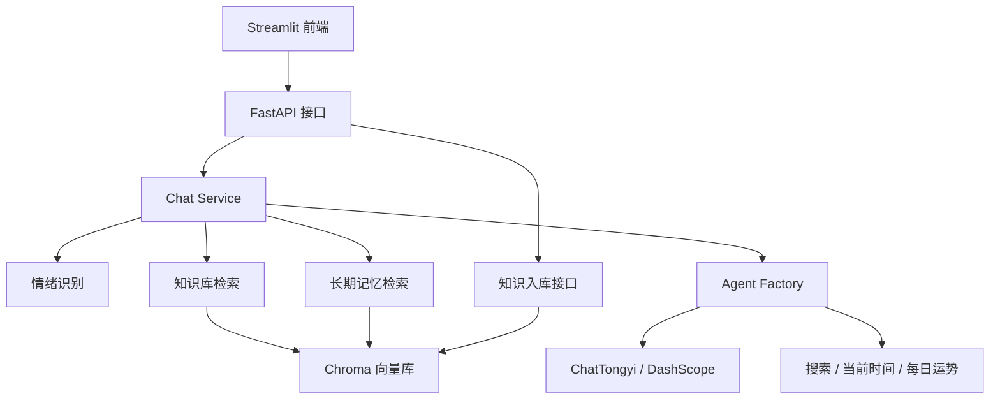

# StarOracle_Agent 星座运势助手

基于 LangChain / LangGraph / Streamlit 构建的星座运势问答助手，支持 ReAct Agent 推理、多工具调用、RAG 知识库检索、长期记忆、每日运势占卜，以及 URL / PDF / 文本知识入库。

## 项目简介

本项目以“星座运势问答”为主场景，后端使用 FastAPI 提供接口服务，Agent 侧通过 LangChain ReAct 模式完成推理与工具选择，前端使用 Streamlit 提供聊天式交互界面。

系统包含以下能力：

- 结合用户输入进行情绪识别与角色风格切换
- 通过 Chroma 向量库实现知识库检索与长期记忆
- 支持 URL、PDF、文本三种方式写入知识库
- 支持每日运势占卜工具
- 支持滚动日志与统一 YAML 配置管理
- 支持 Streamlit 历史对话、当前聊天与多轮问答

## 项目结构

```text
StarOracle_Agent/
├── server.py                 # FastAPI 入口
├── streamlit_app.py          # Streamlit 前端
├── config/                   # YAML 配置
├── prompts/                  # 提示词模板
├── services/                 # 聊天、记忆、知识库、情绪等服务
├── tools/                    # 工具函数
├── utils/                    # 配置、日志、路径、Prompt 加载
├── logs/                     # 日志文件
└── README.md
```

## 主要特性

| 特性 | 说明 |
| --- | --- |
| ReAct Agent | 基于 Thought / Action / Observation 的推理链路 |
| RAG 检索增强 | 使用 Chroma + DashScope Embedding 对知识库内容做向量检索 |
| 长期记忆 | 通过独立记忆库保存用户历史偏好和上下文 |
| 多工具调用 | 集成搜索、当前时间、每日运势占卜等工具 |
| 知识入库 | 支持 URL / PDF / 文本入库，并支持去重 |
| 流式前端 | Streamlit 聊天界面支持历史消息留存与交互式问答 |
| 统一配置 | 模型、日志、提示词路径均由 YAML 管理 |

## 技术架构



## 技术栈

- Python
- FastAPI
- Streamlit
- LangChain
- LangGraph
- Chroma
- DashScope / 通义千问
- YAML 配置
- Requests

## 功能说明

### 聊天能力

- 支持普通问答
- 支持快捷问题入口
- 支持历史对话保存和切换
- 支持“新对话”和“清空当前聊天”

### 知识库能力

- `add_urls`：从 URL 页面抽取文本并入库
- `add_pdfs`：从 PDF 文档入库
- `add_texts`：从纯文本入库
- 聊天时自动进行知识库检索
- 支持去重，重复内容不会反复写入

### 记忆能力

- 根据用户输入和回答，提取长期记忆
- 将用户偏好、身份信息和历史上下文保存到 Chroma
- 下次聊天时自动召回

### 工具能力

- 搜索工具
- 当前时间工具
- 每日运势占卜工具

## 快速开始

### 1. 环境要求

- Python 3.10+
- Conda 环境 `ai_learn`
- 可用的 DashScope API Key

### 2. 安装依赖

```bash
pip install -r requirements.txt
```

### 3. 配置 API Key

请先在阿里云百炼控制台申请 DashScope API Key，然后配置环境变量：

#### Windows CMD

```bat
set DASHSCOPE_API_KEY=your-api-key
```

#### Windows PowerShell

```powershell
$env:DASHSCOPE_API_KEY="your-api-key"
```

### 4. 启动后端

```bash
python server.py
```

### 5. 启动前端

```bash
streamlit run streamlit_app.py
```

前端默认连接：`http://127.0.0.1:8000`

## 使用方式

### 聊天

打开 Streamlit 页面后，直接在输入框输入问题即可。

### 快捷问答

点击页面上方的快捷问题，可以快速发起星座相关提问。

### 知识入库

在左侧控制台中可以：

- 输入 URL 入库
- 上传 PDF 入库
- 输入文本入库

### 历史对话

- 当前聊天会保留在页面中
- 旧会话会自动保存到历史列表
- 可以点击历史会话恢复内容
- 可以删除历史会话

## 配置说明

### `config/models.yml`

统一管理：

- 聊天模型
- 情绪识别模型
- 记忆抽取模型
- Embedding 模型
- 向量库参数
- Agent 参数
- 工具参数

### `config/prompts.yml`

统一管理：

- 系统提示词
- 情绪识别提示词
- 记忆抽取提示词

### `config/logs.yml`

统一管理：

- 日志目录
- 日志文件名
- 单文件大小
- 备份数量
- 控制台日志级别
- 文件日志级别
